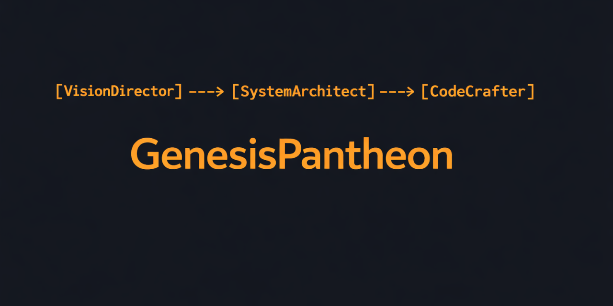
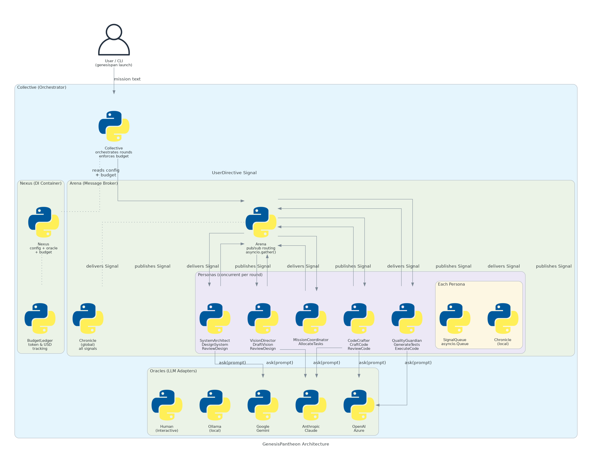

<p align="center"></p>

<h1 align="center">GenesisPantheon</h1>
<p align="center">A production-grade multi-agent AI framework for collaborative software development</p>

<p align="center">
  <a href="https://github.com/TemidireAdesiji/genesis-pantheon/actions/workflows/ci.yml"></a>
  <a href="LICENSE"></a>
</p>

<p align="center">
  <a href="#what-it-does">What it does</a> •
  <a href="#quick-start">Quick start</a> •
  <a href="#architecture">Architecture</a> •
  <a href="#built-in-personas">Built-in personas</a> •
  <a href="#cli-reference">CLI reference</a> •
  <a href="#library-api">Library API</a> •
  <a href="#configuration">Configuration</a> •
  <a href="#design-decisions">Design decisions</a> •
  <a href="#known-limitations">Known limitations</a> •
  <a href="#contributing">Contributing</a> •
  <a href="#license">License</a>
</p>

---

## What it does

GenesisPantheon lets you assemble a team of AI agents (called **Personas**) that pass typed messages (called **Signals**) to each other and collaboratively build software end-to-end: from a plain-English requirement through product spec, architecture design, code generation, code review, test generation, and automated test execution.

Each persona subscribes to certain signal types and responds by running one or more **Directives** (discrete units of LLM work). The framework routes signals, runs all active personas concurrently each round, tracks token spend against a budget cap, and writes the generated code to a workspace directory.

You can use GenesisPantheon in two ways:

- **CLI** -- run `genesispan launch "your mission"` to start an autonomous development session
- **Python library** -- import the classes, wire your own personas and directives, and call `collective.run()`

---

## Tech stack

<p align="center">
  
  
  
  
  
  
  
  
  
  
  
  
  
</p>

---

## Quick start

### Install

```bash
pip install genesis-pantheon
```

Or from source:

```bash
git clone https://github.com/TemidireAdesiji/genesis-pantheon.git
cd GenesisPantheon
pip install -e ".[dev]"
```

### Configure

```bash
# Create the default config file at ~/.genesis_pantheon/blueprint.yaml
genesispan init-config

# Set your LLM API key
export OPENAI_API_KEY="sk-..."         # for OpenAI
export ANTHROPIC_API_KEY="sk-ant-..."  # for Anthropic
```

### Run a mission

```bash
genesispan launch "Build a command-line todo list app in Python" \
  --budget 5.0 \
  --rounds 6 \
  --output ./my-todo-app
```

The framework will write the generated product spec, architecture, code, and tests to `./my-todo-app/`.

### Python API

```python
import asyncio
from genesis_pantheon import Collective, Nexus
from genesis_pantheon.personas import (
    VisionDirector,
    SystemArchitect,
    CodeCrafter,
    MissionCoordinator,
)

async def main():
    ctx = Nexus()
    ctx.config.llm.api_key = "sk-..."
    ctx.budget.max_budget = 5.0

    collective = Collective(context=ctx)
    collective.recruit([
        VisionDirector(),
        SystemArchitect(),
        MissionCoordinator(),
        CodeCrafter(),
    ])

    signals = await collective.run(
        n_rounds=6,
        mission="Build a command-line todo list app in Python",
    )
    print(f"Completed with {len(signals)} signals")

asyncio.run(main())
```

---

## Architecture

<p align="center"></p>

The framework has five layers:

```
User / CLI
    |
Collective           -- top-level orchestrator; owns the Arena and Nexus
    |
Arena                -- message broker; routes Signals; runs all Personas concurrently per round
    |
Personas             -- autonomous agents with observe -> think -> act loop
    |
Directives           -- discrete LLM tasks; call Oracle to produce output
    |
Oracles              -- provider adapters (OpenAI, Anthropic, Gemini, Azure, Ollama, Human)
```

**Shared state** is held by the `Nexus` (a dependency-injection container): the Blueprint config, the Oracle instance (lazily created), and the BudgetLedger. Every persona and directive reads from the same Nexus.

**Signal flow:**

1. `collective.launch_mission(text)` publishes a `UserDirective` Signal to the Arena.
2. The Arena delivers each Signal to every Persona whose subscription set includes that signal's `cause_by` type.
3. Personas observe buffered Signals, choose a Directive to run, and publish a new Signal containing the Directive's output.
4. The loop continues round by round until all Personas are idle, the round limit is reached, or the budget cap is hit.

---

## Built-in personas

| Persona | Role | Subscribes to | Directives |
|---|---|---|---|
| `VisionDirector` | Product manager | `UserDirective` | `DraftVision`, `ReviewDesign` |
| `SystemArchitect` | Architect | `DraftVision` | `DesignSystem`, `ReviewDesign` |
| `MissionCoordinator` | Project manager | `DraftVision` | `AllocateTasks` |
| `CodeCrafter` | Engineer | `AllocateTasks`, `DesignSystem` | `CraftCode`, `ReviewCode`, `CondenseCode` |
| `QualityGuardian` | QA engineer | `CraftCode`, `CondenseCode` | `GenerateTests`, `ExecuteCode`, `DiagnoseError` |
| `InsightHunter` | Researcher | (custom) | (custom research directives) |

---

## CLI reference

```
genesispan [COMMAND] [OPTIONS]
```

### `launch`

Run a software development mission.

```bash
genesispan launch MISSION [OPTIONS]
```

| Option | Type | Default | Description |
|---|---|---|---|
| `--budget` | float | `10.0` | Maximum USD spend |
| `--rounds` | int | `5` | Maximum number of rounds |
| `--code-review` | int (0/1) | `1` | Enable self-review of generated code |
| `--run-tests` | int (0/1) | `0` | Enable automated test execution |
| `--name` | str | `""` | Project name for workspace subdirectory |
| `--output` | path | workspace config | Directory to write output files |

### `init-config`

Create `~/.genesis_pantheon/blueprint.yaml` with defaults. Does not overwrite an existing file.

```bash
genesispan init-config
```

### `list-oracles`

Print available LLM provider types.

```bash
genesispan list-oracles
```

### `version`

Print the installed framework version.

```bash
genesispan version
```

---

## Library API

### `Collective`

```python
from genesis_pantheon import Collective, Nexus

ctx = Nexus()
collective = Collective(context=ctx)
```

| Method | Signature | Description |
|---|---|---|
| `recruit` | `(personas: list[Persona]) -> None` | Register personas with the Arena |
| `allocate_budget` | `(amount: float) -> None` | Override the budget cap at runtime |
| `launch_mission` | `(mission: str, send_to: str = "") -> None` | Publish the initial UserDirective Signal |
| `run` | `async (n_rounds: int, mission: str, ...) -> list[Signal]` | Drive the round loop; returns all Signals produced |

### `Persona` (base class)

```python
from genesis_pantheon.personas.persona import Persona, PersonaReactMode
```

| Attribute / Method | Description |
|---|---|
| `name: str` | Unique identifier; used in signal routing |
| `profile: str` | Short role description injected into LLM system prompts |
| `goal: str` | Goal statement injected into prompts |
| `react_mode: PersonaReactMode` | `BY_ORDER` (sequential) or `REACT` (signal-driven) |
| `set_actions(directives)` | Assign directive classes to this persona |
| `subscribe_to(signal_types)` | Register signal types this persona reacts to |
| `async run(signal) -> Signal | None` | Execute one round |
| `put_signal(signal)` | Enqueue a Signal from outside |
| `is_idle: bool` | True when signal buffer is empty |

### `Directive` (base class)

```python
from genesis_pantheon.directives.base import Directive, DirectiveOutput
```

| Method | Description |
|---|---|
| `async run(*args, **kwargs) -> DirectiveOutput` | Execute; subclasses implement this |
| `async _ask(prompt, system_msgs=None) -> str` | Call the Oracle; budget is checked before each call |

### `Signal`

```python
from genesis_pantheon import Signal
```

| Field | Type | Description |
|---|---|---|
| `id` | `str` | Auto-generated UUID |
| `content` | `str` | Plain text payload |
| `structured_content` | `BaseModel | None` | Typed payload for structured data |
| `role` | `str` | `"user"` or `"assistant"` |
| `cause_by` | `str` | Name of the Directive class that produced this signal |
| `sent_from` | `str` | Name of the Persona that published it |
| `send_to` | `set[str]` | `{"<all>"}` or a set of persona names |
| `metadata` | `dict` | Arbitrary extra data |

### `Nexus`

```python
from genesis_pantheon import Nexus

ctx = Nexus()
ctx.config.llm.model = "gpt-4o"
ctx.config.llm.api_key = "sk-..."
ctx.budget.max_budget = 10.0
oracle = ctx.oracle()   # lazily instantiated; cached
```

### Custom persona example

```python
from genesis_pantheon.personas.persona import Persona, PersonaReactMode
from genesis_pantheon.directives.base import Directive, DirectiveOutput

class SummarizeDirective(Directive):
    async def run(self, signal) -> DirectiveOutput:
        response = await self._ask(
            f"Summarize the following in one sentence:\n\n{signal.content}"
        )
        return DirectiveOutput(content=response)

class SummarizerPersona(Persona):
    name: str = "Summarizer"
    profile: str = "Expert summarizer"
    goal: str = "Produce concise summaries"

    def __init__(self, **kwargs):
        super().__init__(**kwargs)
        self.set_actions([SummarizeDirective])
        self.subscribe_to(["UserDirective"])
```

---

## Configuration

Run `genesispan init-config` to create `~/.genesis_pantheon/blueprint.yaml`. Environment variables override YAML values.

### LLM settings

```yaml
llm:
  api_type: openai           # openai | azure | anthropic | gemini | ollama | human
  model: gpt-4o
  api_key: ""                # or set via env var (see below)
  base_url: ""               # required for azure and ollama
  temperature: 0.0           # 0.0 to 2.0
  max_tokens: 4096
  stream: true
  timeout: 300               # seconds
  max_retries: 3
```

### Workspace settings

```yaml
workspace:
  path: ~/.genesis_pantheon/workspace
  auto_archive: true         # clear signal history after run
  use_git: true              # init a git repo in the workspace
  project_name: ""           # subdirectory name
```

### Per-persona oracle override

Assign a different LLM to a specific persona by name:

```yaml
role_oracles:
  VisionDirector:
    api_type: anthropic
    model: claude-3-5-sonnet-20241022
    api_key: "${ANTHROPIC_API_KEY}"
  CodeCrafter:
    api_type: openai
    model: gpt-4o
```

### Environment variables

| Variable | Description |
|---|---|
| `GP_LLM_API_KEY` | API key (overrides `llm.api_key` in YAML) |
| `GP_LLM_MODEL` | Model name |
| `GP_LLM_API_TYPE` | Provider type |
| `GP_LLM_BASE_URL` | Base URL (Azure / Ollama) |
| `GP_MAX_BUDGET` | Budget cap in USD |
| `GP_MAX_TOKENS` | Max tokens per request |
| `OPENAI_API_KEY` | OpenAI API key |
| `ANTHROPIC_API_KEY` | Anthropic API key |
| `AZURE_OPENAI_API_KEY` | Azure OpenAI API key |
| `AZURE_OPENAI_ENDPOINT` | Azure OpenAI endpoint URL |
| `AZURE_OPENAI_DEPLOYMENT` | Azure deployment name |
| `GOOGLE_API_KEY` | Google AI API key |
| `GEMINI_MODEL` | Gemini model name |
| `OLLAMA_BASE_URL` | Ollama server URL (default: `http://localhost:11434`) |
| `OLLAMA_MODEL` | Ollama model name |

---

## Design decisions

**Signal pub/sub instead of a task graph.** Personas do not call each other directly. They publish Signals and subscribe to Signal types. This keeps personas decoupled and allows the Arena to run all active personas concurrently each round with `asyncio.gather`. Adding a new persona only requires declaring its subscriptions -- no wiring changes elsewhere.

**Nexus as a shared DI container.** Rather than threading config and oracle references through every method call, all components read from a single `Nexus` instance set at Arena insertion time. This makes the Oracle lazily instantiated and swappable without rebuilding components.

**Three react modes.** `BY_ORDER` runs directives in declaration order (deterministic, good for linear pipelines). `REACT` selects the next directive based on the type of incoming signal (adaptive). `PLAN_AND_ACT` is a reserved extension point for personas that should plan before acting.

**Chronicle is per-persona, not global.** Each Persona keeps its own `Chronicle` of signals it has observed. The Arena also keeps a global Chronicle of all published signals. This lets a persona query its own history without scanning unrelated signals.

**Output repair at the oracle layer.** LLMs occasionally produce malformed JSON or code wrapped in extra markdown fences. `oracles/postprocess/repair.py` strips fences, removes trailing commas, and normalises quotes before the Directive receives the response. This is a practical tradeoff: fix the common cases automatically rather than require prompt engineering perfection.

---

## Known limitations

- **Single process only.** The entire run executes in one Python process using `asyncio`. There is no distributed execution.
- **Code execution is unsandboxed.** `ExecuteCode` runs generated Python in a subprocess with no CPU, memory, or time limits. Do not use it in environments where the LLM output is untrusted.
- **Output parsing is fragile.** Directives rely on the LLM following a specific markdown format. The repair utilities handle common deviations but cannot catch all edge cases.
- **No task dependency enforcement.** `AllocateTasks` describes dependencies in prose; the Arena does not parse or enforce execution order.
- **`PLAN_AND_ACT` react mode is not implemented.** The enum value exists but no built-in persona uses it.
- **No CLI support for custom personas.** Extending the framework requires writing Python. There is no way to define custom personas in YAML.
- **`auto_archive: true` clears signal history after the run.** If you need to query signals after `collective.run()` returns, set `auto_archive: false` in the workspace config or pass `auto_archive=False` to `run()`.

---

## Contributing

Contributions are welcome. See [CONTRIBUTING.md](CONTRIBUTING.md) for the development setup, coding conventions, and pull request process.

```bash
# Install dev dependencies
pip install -e ".[dev]"

# Run the test suite
make test

# Lint and type-check
make lint
```

---

## License

MIT. See [LICENSE](LICENSE).
